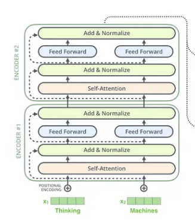

### Transformer-EN2AR-From-Scratch

This repository contains a PyTorch implementation of the Transformer model from scratch, following the seminal paper [Attention Is All You Need](https://arxiv.org/abs/1706.03762). This model is used for translating text from English to Arabic.

## Project Overview

The Transformer model introduced in "Attention Is All You Need" revolutionized the field of natural language processing by using self-attention mechanisms, eliminating the need for recurrent layers. This implementation aims to provide a clear and concise example of how to build such a model from the ground up using only PyTorch and tensors.

### Key Features
<p align="center">
  
</p>

- **Implemented from Scratch**: The entire Transformer architecture is built from the ground up using PyTorch, adhering closely to the original paper's specifications.
- **English to Arabic Translation**: The model is trained to translate sentences from English to Arabic, demonstrating the practical application of the Transformer in sequence-to-sequence tasks.
- **Educational and Practical**: This project serves both as a practical application for translation and as an educational resource for understanding the inner workings of the Transformer model.

## Files in the Repository

- `Transformer.ipynb`: The main Jupyter Notebook containing the complete implementation and training process of the Transformer model for English to Arabic translation.

## Components of the Transformer

### 1. Embedding Layer
The Embedding Layer is responsible for converting input tokens, which are usually represented as integers, into dense vectors of fixed size. This transformation is crucial as it enables the model to work with continuous input values rather than discrete ones. The embeddings capture semantic information about the tokens, allowing the model to understand and process the input text more effectively.

### 2. Positional Encoding
<p align="center">
  
</p>
Transformers lack the inherent sequential nature of RNNs, which is why Positional Encoding is essential. This component adds a unique vector to each token's embedding, providing information about the token's position in the sequence. These encodings help the model to distinguish between tokens that might be identical in content but different in context based on their position.

### 3. Multi-Head Attention
<p align="center">
  
</p>
Multi-Head Attention is a core component of the Transformer architecture, enabling the model to focus on different parts of the input sequence simultaneously. It consists of several attention heads, each learning to capture different aspects of the input sequence. By doing so, the model can understand the context better and establish relationships between distant tokens.

### 4. Feed-Forward Neural Network
<p align="center">
  
</p>
Each position in the sequence is processed independently by a Feed-Forward Neural Network (FFN). This network, typically consisting of two linear transformations with a ReLU activation in between, allows the model to apply complex transformations to each token's representation, enhancing its ability to capture intricate patterns in the data.

### 5. Encoder
<p align="center">
  
</p>
The Encoder is a stack of identical layers, each comprising Multi-Head Attention and Feed-Forward Neural Networks. The Encoder processes the input sequence to produce context-aware representations. Each layer in the stack refines these representations, enabling the model to capture higher-level abstractions and dependencies within the input sequence.

### 6. Decoder
<p align="center">
  
</p>
The Decoder is similar to the Encoder but includes an additional layer of Multi-Head Attention over the Encoder's output. This structure allows the Decoder to generate the output sequence by attending to both the input context and the previously generated tokens. The Decoder also consists of a stack of identical layers, each refining the generated sequence's representations.

### 7. Output Layer
The Output Layer is the final component of the Transformer model. It takes the Decoder's output and applies a linear transformation followed by a softmax function to produce a probability distribution over the target vocabulary. This distribution is used to generate the next token in the sequence, enabling the model to produce translations or other types of sequential outputs.

## Installation and Usage

1. **Clone the Repository**:
    ```bash
    git clone https://github.com/MohamedRagabAbbas/Transformer-EN2AR-From-Scratch.git
    cd transformer-from-scratch
    ```

2. **Install Dependencies**:
    Ensure you have PyTorch and other necessary dependencies installed. You can do this using pip:
    ```bash
    pip install torch numpy
    ```

3. **Run the Notebook**:
    Open the `Transformer.ipynb` notebook in Jupyter and run the cells to train and evaluate the model.

## Training the Model

The notebook includes steps to preprocess the data, build the model architecture, and train the model. Ensure you have a suitable dataset for English to Arabic translation, or follow the dataset preparation steps provided in the notebook.

## References

- Vaswani, A., Shazeer, N., Parmar, N., Uszkoreit, J., Jones, L., Gomez, A. N., ... & Polosukhin, I. (2017). [Attention is all you need](https://arxiv.org/abs/1706.03762). In Advances in neural information processing systems (pp. 5998-6008).

## Acknowledgements

- The implementation and training process are inspired by the PyTorch community and the original authors of the Transformer model.


